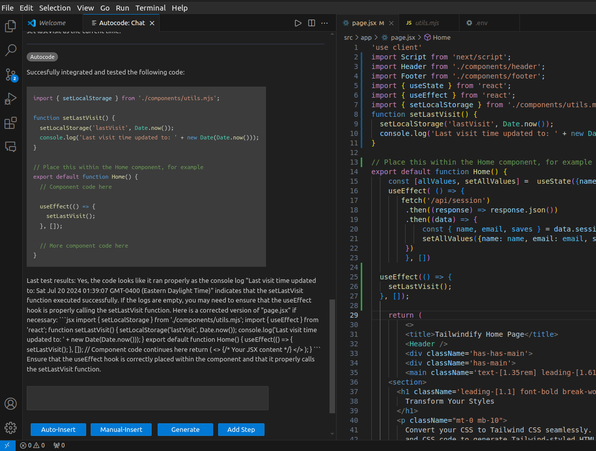

# Overview

A self-testing and self-debugging code generator for React, which has gotten progressively more sophisticated.

## Current Status

The **[latest version](https://github.com/emoryhubbard/autocode-client)** is a VS Code extension which provides a chat interface as an AI coding assistant:

This repository contains an older prototype, a web application. For current status on the project, see the repository for the **[latest version](https://github.com/emoryhubbard/autocode-client)**.

Below, you will find the previous versions which functioned as web applications. 

## Autocode Native Interface

The Autocode Native Interface is an expanded version of the original Autocode application, designed specifically for generating, testing, and debugging code for React applications. Unlike its predecessor, **[Autocode Classic](https://autocode-five.vercel.app/)**, the Autocode Native Interface offers enhanced capabilities for modifying both .js and .jsx files, with the ultimate goal of helping React Developers automate implementation of app features through writing precise instructions.

**[Autocode Milestones Video](https://youtu.be/bgMEVYLi2w8)**

**[Example of Successful Feature](https://youtu.be/Yasyke__WGA)**

**[Autocode Native Interface Demo Video](https://youtu.be/k9advUWgDaE)**

### Purpose

The primary purpose of the Autocode Native Interface is to simplify the process of code generation and verification for React applications. It provides developers with a local development interface to interact with a local Autocode Native client, enabling them to incrementally add features to their applications through bite-sized steps.

### Usage

An **[Autocode Native Interface Preview](https://autocode-five.vercel.app/create-job)** is viewable on the web, but to experiment with it and generate code, you will need to run it locally instead.

Note: Autocode is still early in development. Usage is a complex operation due to non-predictive form fields, and the results are limited by only allowing a small number of steps to be run.

To use the Autocode Native Interface, developers must follow these steps:

1. Clone the following repositories to their local machine:
   - Autocode
   - [Autocode Native](https://github.com/emoryhubbard/autocode-native)
   - [Express Autocode API](https://github.com/emoryhubbard/express-autocode-api)
   - Their own repository that they desire to modify

2. Run `npm run dev` on their React application to enable automatic reloading of file changes.

3. Configure the `.env` file and other areas in each repository to use the correct URLs and ports for their local servers.

4. Provide their own `serviceAccountKey.json` file for their Firebase account in the Express Autocode API repository and create a "features" collection.

5. Run Autocode and the Express server, and navigate to the create-job page.

6. Follow the prompts to add a new feature to their application.

7. Run the Autocode Native client, which automatically modifies the files in their repository to include the new feature and performs testing.

8. If any errors occur during the testing or debugging process, detailed information will be displayed in the console.

## Autocode Classic

This Angular 17.0 application is a self-testing and self-debugging code generator named **[Autocode](https://autocode-five.vercel.app/)**.

Its primary goal is to improve the quality of code generation by incorporating a ChatGPT API for prompt-based JavaScript code creation. The generated code undergoes an automatic testing and debugging loop from [Autocode's Express API](https://github.com/emoryhubbard/express-autocode-api), ensuring that the output is already tested and verified.

**[Autocode Version 2.0 Demo Video](https://youtu.be/zm6YHLV1Dag)**

**[Autocode Version 1.0 Demo Video](https://youtu.be/Iq5_HaKzL6Y)**

# Development Environment

This application is developed using the following technologies and tools:

- **Angular 17.0:** The front-end of "Autocode" is built using the latest version of Angular, which now includes Angular SSR (Server-Side Rendering) as a fundamental part of the official Angular engine, deployed with Vercel.
- **Express Server:** The back-end REST API is served through an Express server instance deployed with Render.
- **TypeScript:** The majority of the source code is written in TypeScript, enhancing code maintainability and scalability.
- **Pupeteer:** As a headless browser automation library, Puppeteer is responsible for running the generated code and capturing debug information to send to Autocode's automated testing and debugging system.
- **Visual Studio Code (VS Code):** The development environment is Visual Studio Code, a powerful and extensible code editor.
- **ChatGPT API:** Autocode utilizes the ChatGPT API for prompt-based code generation. An API key is required for accessing ChatGPT services.
- **Node.js:** Both the front-end and back-end leverage Node.js for seamless JavaScript development.

# Useful Websites

- [Angular](https://angular.io/)
- [Express](https://expressjs.com/)
- [TypeScript](https://www.typescriptlang.org/)
- [Visual Studio Code (VS Code)](https://code.visualstudio.com/)

# Future Work

- Enhance user experience by incorporating additional customization options for the generated code.
- Explore and implement advanced features for code functionality testing and verification.
- Continuously improve and expand the functionality of "Autocode" based on user feedback.
- Design and implement a tracing-inspired algorithm to enhance debugging capabilities

